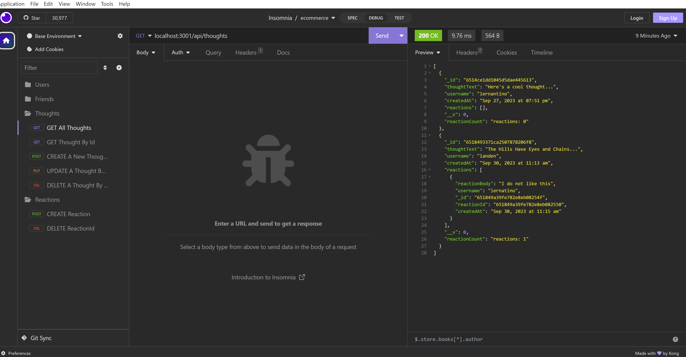

# Landen Backend Social Media Site

## Title

Landen Backend Social Media Site

# Table of Contents

- [GitHub](#github)
- [Description](#description)
- [Installation](#installation)
- [Usage](#usage)
- [License](#license)
- [How To Contribute](#howtocontribute)
- [Tests](#tests)
- [Screenshot](#screenshot)
- [Link](#link)

## GitHub

[Link](https://www.github.com/lwalker107)

## Email

landenwalker880@gmail.com

## Description

Social Media Backend using MongoDB, Express and Mongoose that allows the user to create/delete users, thoughts,
friends for the users and reactions for the thoughts. Also, allows users to update the user/thought models and
get information on all users/thoughts or a single user/thought by using the ID associated with each one.

## Installlation 

npm i

## Usage

Will need mongodb, express, node, dotenv and mongoose for the project to work successfully. Also,
will need Insomnia to test api routes.

## License

MIT

## How to Contribute

You need to know my GitHub username, my email for questions and a working knowledge of Git.

## Tests

## Screenshot

## Link 

https://drive.google.com/file/d/1DFFF-e193le8YKHQyb4IoAbfwPFZJ5T1/view